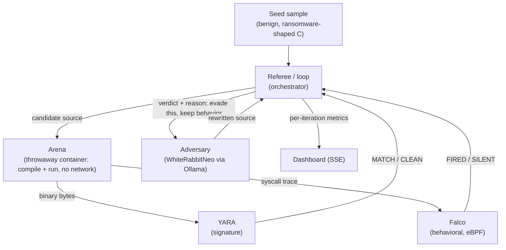
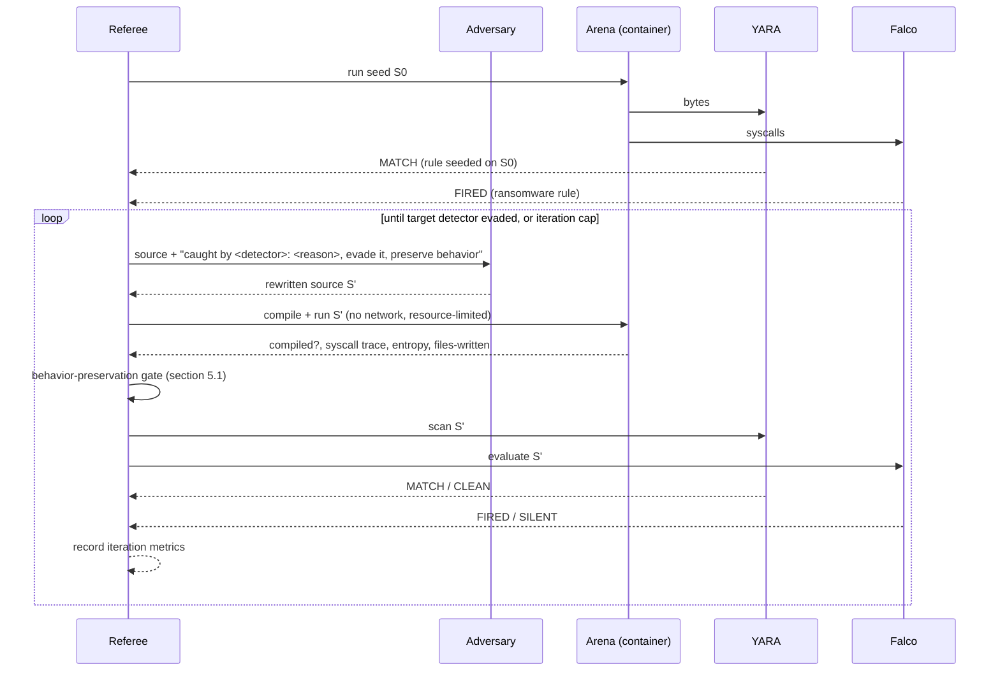

# Hydra — Architecture

Status: Draft
Last updated: 2026-08-18

Hydra is an adversarial evasion lab. A local, security-tuned LLM tries to rewrite
a benign malware sample to slip past two real detectors, in a closed loop, and we
measure how each detector holds up. The result is a number, not a scripted reveal:
the signature detector is evaded in a few iterations; the behavioral detector is
not evaded at all while the sample still behaves like malware.

This document is the engineering source of truth. It assumes an empty repository
and describes the system to be built.

Tagline: kill one signature, it grows a new head.

## 1. Context and problem

Signature detection identifies a file by its bytes. Metamorphic malware defeats
this by rewriting itself between runs: same behavior, new bytes, new hash. This is
an old technique, but in 2025 Google's threat intelligence group reported field
malware that uses an LLM to do the rewriting (PromptFlux, PromptLock). The new
element is not "the bytes change" — template engines have done that for decades —
it is that the rewriter can **reason about why it was detected and adapt**.

That raises the question this project answers: when the adversary is an LLM that
adapts to a detector's feedback, which kind of detection survives? Signature, or
behavior?

## 2. What Hydra is, and what it proves

Hydra runs a closed loop:

1. A benign, ransomware-shaped sample is compiled and run in a throwaway sandbox.
2. Two real detectors judge it: YARA (signature) and Falco (behavioral, eBPF).
3. Whichever detector caught it, its verdict and reason are fed to a local LLM
   (WhiteRabbitNeo via Ollama), which rewrites the sample to evade that detector
   while preserving behavior.
4. Recompile, re-run, re-judge. Repeat.

Measured outcomes:

- Signature (YARA): evaded after a small number of iterations. Changing bytes is
  easy, so the adversary wins quickly.
- Behavioral (Falco): not evaded across the run, as long as the sample still
  performs the ransomware behavior. The only way the adversary evades the
  behavioral rule is to stop doing the malicious action — which the loop detects
  and reports.

The claim this proves: against an adaptive AI adversary, signatures are brittle
and behavior is robust, because evading behavior requires abandoning the behavior.

Why the LLM is necessary: the loop closes on detector *feedback*. A template
mutator can permute bytes (enough to beat a signature) but cannot read "Falco
fired because you rewrote 50 files with high-entropy content" and reason about it.
The adaptation step is the LLM's job and cannot be done without a reasoner.

## 3. Scope, non-goals, and ethics

This is authorized, defensive detector-robustness research: a benign sample, our
own detectors, offline, to show why behavioral detection is stronger. It is not a
tool for evading third-party defenses.

Non-goals and hard limits:

- The sample is benign (section 6). It has no capacity to harm real data, reach
  the network, or persist.
- The evasion target is only Hydra's own lab detectors. Nothing here is aimed at
  production AV/EDR.
- Real malware is never executed. It is used only for static rule validation, in
  an isolated context (section 9.3), and that step is optional.
- Everything runs offline on one laptop. No sample or telemetry leaves it.

## 4. System overview



The referee is the only stateful control point. The arena is disposable and
network-isolated. The two detectors are real, off-the-shelf tools. The adversary
is a local model; nothing in the loop requires the network.

## 5. The adversarial loop



The run has two tracks, executed in sequence:

- Track 1 — evade the signature. Target YARA. Expected to succeed in a few
  iterations. Records `iterations_to_evade_signature`.
- Track 2 — evade the behavior. Target Falco, with the behavior-preservation gate
  enforced. Expected to fail: every behavior-preserving rewrite still trips Falco.
  Records `behavioral_evasions_while_behavior_preserved` (target: 0). A final,
  ungated step lets the adversary break behavior to evade Falco, demonstrating
  the tradeoff.

### 5.1 Behavior-preservation gate

After each run the referee decides whether S' still exhibits the ransomware
behavior class, from the arena observations (not from the source): at least K
distinct files created and rewritten in place, with per-file written-content
Shannon entropy at or above H, within one execution. A candidate that no longer
passes the gate has abandoned the behavior; in Track 2 that is recorded as
"evaded only by ceasing to be malware." K and H are fixed constants recorded next
to the Falco rule and chosen so the gate does not trip on trivial processes.

### 5.2 Adversary feedback

The prompt to the adversary includes the current source and a structured reason:

- YARA caught it: the matched rule name and the specific strings/byte pattern that
  matched. Instruction: remove those byte features, preserve behavior.
- Falco caught it: the fired rule and the syscall pattern (e.g. "opened and
  rewrote N files with high-entropy content"). Instruction: evade, preserve
  behavior.

If a candidate does not compile, the referee returns the compiler error to the
adversary and retries, up to a per-iteration retry cap. If the adversary is
unavailable, a deterministic byte/identifier mutator stands in for Track 1 only
(it cannot adapt, so it is not used for Track 2).

## 6. The sample and its safety

The seed sample is benign and ransomware-shaped. On each run, inside the arena, it:

1. creates a private working directory in the container's ephemeral filesystem;
2. writes K throwaway files with known plaintext there;
3. rewrites each file in place with high-entropy content, using a key it retains
   (reversible);
4. decrypts to confirm reversibility, then exits.

It presents the behavior behavioral detectors target — many files rewritten with
high-entropy content in a short window — which is what makes the Falco result
meaningful. It touches only files it created this run.

Safety invariants (enforced and checked, section 10):

1. The container runs with no network (`--network=none`), no host mounts, dropped
   capabilities, a seccomp profile, CPU/memory/time limits, and is removed after
   the run.
2. The sample writes only inside its working directory in the container.
3. The rewrite is reversible; nothing is destroyed.
4. No network and no persistence syscalls occur; their absence is verified from
   the trace. A candidate that introduces a network syscall is rejected.
5. The adversary rewrites only this sample; the prompt forbids adding capability,
   and the referee rejects candidates that violate invariant 4.

## 7. Components

| Component | Path | Responsibility |
|---|---|---|
| Seed sample | `sample/seed.c` | The benign, ransomware-shaped starting source. |
| Adversary | `adversary/llm.py` | Build the evade prompt from detector feedback; call WhiteRabbitNeo via Ollama; return rewritten source. |
| Offline mutator | `adversary/mutator.py` | Deterministic byte/identifier permutation; Track-1 fallback only. |
| Arena | `arena/run.py`, `arena/Dockerfile` | Compile and run a candidate in a throwaway, network-isolated container; capture syscalls, entropy, files. |
| Signature detector | `detectors/yara_detector.py`, `detectors/rules/` | Seed a YARA rule from S0; scan each binary. |
| Behavioral detector | `detectors/falco_detector.py`, `detectors/hydra_ransomware.yaml` | Evaluate the ransomware rule against the strace-derived trace (default). |
| Real behavioral sensor | `detectors/falco_real.py`, `detectors/falco/` | Same rule, sourced from a real Falco/eBPF sensor. Opt-in (`HYDRA_REAL_FALCO=1`), §9.2. |
| Referee | `referee/loop.py` | Drive the loop, the two tracks, the gate; record metrics to `results.json`. |
| Server | `server.py` | HTTP + SSE control point for the live dashboard. |
| Dashboard | `ui/index.html` | SSE client: renders each iteration, the rewrite diff, and the final metrics. |
| Validation | `validate/` | Static checks that the detection rules fire on real ransomware (section 9.3). |

## 8. Runtime and sandbox

The arena runs Linux. On the macOS demo laptop, Colima provides the Linux VM and
Docker runtime; candidates run as throwaway containers inside it.

- Compilation and execution happen in the container, never on the host.
- The container has no network and no host filesystem access.

Decision on behavioral capture: the default sensor is `strace`-based syscall
capture inside the container, evaluated against the same rule logic real Falco
would apply. A real Falco (eBPF) sensor is also implemented and opt-in via
`HYDRA_REAL_FALCO=1` — see §9.2 for what that needed and what it doesn't cover
yet. Either way the rule logic is identical; swapping the sensor is a capture
mechanism change only, not a change to the behavioral claim.

## 9. Detectors

### 9.1 Signature — YARA

At baseline the referee generates a YARA **family rule** from S0: its exact
SHA-256 plus several characteristic strings it embeds (the marker, the temp-dir
name, the status message, the filename format), firing when at least `MIN_MATCH`
(2) of them are present. `scan` runs the `yara` binary against a candidate's
compiled bytes and returns MATCH or CLEAN. A multi-indicator rule is what a real
analyst writes, and it is what makes evasion non-trivial: the adversary must
rewrite *most* of those artifacts — while preserving behavior, keeping the
`%`-format specifiers, and keeping writes under `/tmp` — not just rename one
label. On each attempt the referee tells the model exactly which characteristic
strings still remain (see §5.2), so it adapts until fewer than `MIN_MATCH` are
left. This is the standard signature workflow, using the standard tool.

### 9.2 Behavioral — Falco

The behavioral detector is a Falco rule for ransomware-shaped activity (bulk
rewrite of files with high-entropy content), adapted from Falco's published
ransomware detection. It evaluates the syscall stream from the arena and
reports FIRED or SILENT. Because the rule keys on behavior, byte-level rewrites do
not change its verdict.

**Default sensor: strace.** `arena/entrypoint.sh` traces the candidate in-container
(`-xx -s 4096`, full write-buffer capture); `arena/trace.py` parses that into
files/entropy/network facts on the host. Real, tested, what the loop uses.

**Real sensor: Falco (eBPF), opt-in via `HYDRA_REAL_FALCO=1`.** A long-lived,
privileged sensor container (`detectors/falco/`, built as `hydra-falco`,
wraps `falcosecurity/falco-no-driver` with two rules baked in) watches every
`write()` under `/tmp` and every `connect()` on the host with Falco's modern
eBPF driver — no kernel module or headers needed; it loads cleanly on the
Colima VM's kernel (6.8, BTF present). `-S 4096 -b` captures the full write
buffer, base64, same as strace's `-xx -s 4096` — so this sensor gets real
entropy, not just event counts.

Four things didn't work as expected, and shaped the design:

1. **Container-name enrichment never resolved.** Falco's docker/CRI
   container-name lookup came back null for every container tried in this
   Colima setup, old or new, regardless of which socket path was mounted
   where. So `detectors/falco_real.py` doesn't scope by container identity;
   it scopes by **process tree**. `arena/run.py`'s real-Falco path
   (`_run_detailed_real_falco`) launches the arena container with `Popen`
   instead of the default blocking call so it can ask Docker for the
   container's host pid (`docker inspect .State.Pid`) while it's still
   running, then keeps only sensor events whose pid or ppid equals that root
   pid — i.e. the container's own PID 1 and its direct children.
   Originally this also matched Falco's ancestor-pid fields
   (`proc.apid[2..4]`), sized for an "entrypoint → strace → candidate" chain
   — but that chain never actually happens on this path (point 2 below means
   strace is always off here, so the candidate is always one hop from root).
   The extra depth just sat there matching things it shouldn't have: in
   `metamorphic` mode it also caught gcc's own children (entrypoint → gcc →
   {cc1, as}, two hops from root), so gcc's `/tmp/cc*.s`/`.o` scratch files
   got silently counted as the candidate's output. Caught this by diffing a
   real-Falco run against the strace baseline on the same source: strace
   reported 24 files at ~7.96 bits/byte entropy (correct), real-Falco
   reported 2 files at ~1 bit/byte — and the 2 files were literally the
   compiler's intermediates. Narrowing to pid/ppid-only excludes gcc's tree
   by construction and was verified to fix it (files=0 on a clean run, no
   more phantom low-entropy readings).
2. **A ptrace-traced process is invisible to the eBPF probe.** strace (the
   default sensor) works by ptrace-attaching to the candidate; empirically, a
   process being ptrace-traced stops generating the syscall events Falco's
   probe hooks into — verified directly (a write is captured with strace off,
   silently missing with it on). The two sensors can't watch the same process
   at once, so the real-Falco path passes `HYDRA_NO_STRACE=1` into the
   container and both entrypoints (`entrypoint.sh`, `entrypoint_script.sh`)
   skip the strace wrapper when it's set. The default path is untouched.
3. **The sensor's own event volume slows the host down — and there's no
   cheaper way to get it.** The write rule needs plain `write()`, but Falco
   hardcodes `write` (along with `read`, `pwrite`, `sendfile`, and eight
   other high-volume syscalls) into a fixed "ignored by default" bucket that
   only the blanket `-A` flag unlocks — confirmed directly (`falco -i` still
   lists `write` as ignored even with our rule loaded and referencing it;
   `base_syscalls.custom_set=[write]` is explicitly rejected: "Invalid
   (positive) syscall names ... activate via -A flag"). There's no supported
   way to turn on `write` alone — `-A` turns on all thirteen, host-wide,
   for every process, all the time. Measured the actual cost directly on this
   box: a container with no sensor running gets a live pid in 0.13s; with the
   sensor running (same box, same moment, nothing else changed), the same
   container consistently took 12s+ to get a pid, or didn't within a 10s
   budget at all — roughly two orders of magnitude, and reproducible on
   demand, not an occasional blip. `_run_detailed_real_falco` returns an
   explicit `error` (not a silently-empty report) when the pid-poll budget
   runs out, rather than reporting zero files and looking like a
   behavior-free run. `tests/test_falco_real.py`'s gated integration test
   skips (doesn't fail) when it hits this specifically, since it's an
   environmental constraint of the box it ran on, not a defect.
4. **Still open, discovered while re-testing point 1's fix**: on a handful of
   runs, `Hydra Sensor Connect` fired and got attributed straight to the
   container's own root pid — no ancestor chain involved, so point 1's fix
   doesn't touch it — even though the candidate never calls `connect()` and
   the strace baseline shows zero network syscalls for the same source.
   Not yet root-caused: candidates include the shell/gcc/libc startup chain
   making some NSS/DNS-shaped syscall of its own under `--network=none`
   (plausible — glibc's resolver does this even for local-only lookups) or a
   genuine pid collision in the correlation window on a host cycling through
   this many processes per second. Either way it's a false positive on the
   sandbox's no-network safety check, which is a worse failure mode for a
   demo than a missed detection would be. Not fixed tonight — flagging it
   so nobody re-diagnoses point 1 when they hit this.

This path is genuinely a swap-in when it lands cleanly (real syscalls, real
entropy, independent of the strace/ptrace mechanism), and point 1's fix makes
it correct more often when it does land. But it's opt-in rather than the
default: it needs a privileged, host-pid-namespace container watching the
whole VM — a materially bigger footprint than the tightly-scoped arena the
rest of Hydra runs candidates in — and points 3 and 4 mean it isn't reliably
fast *or* trustworthy enough yet to turn on for a live demo: on this box,
tonight, 0 of 10 back-to-back runs completed cleanly (7 timed out on the
pid-poll, 3 hit the point-4 false positive). This repo hasn't run it live in
front of an audience yet, and shouldn't for this one.
`_run_detailed_strace` (the default) is untouched by any of this.

### 9.3 Payload modes: build-time vs. runtime polymorphism

Hydra runs two payload modes, selectable per run (`mode=metamorphic` default, or
`mode=promptlock`):

- **`metamorphic`** (§5 above): the adversary *rewrites* one candidate between
  builds, driven by detector feedback. Bytes change build-to-build; the
  behavior is the same C program, compiled fresh each time.
- **`promptlock`**: modeled on PromptLock (ESET, Aug 2025) — the first
  documented AI-written ransomware, which has a local LLM generate a fresh Lua
  script **at runtime, every execution**, rather than reusing one binary. In
  this mode the referee (on the host) asks the local LLM to *generate* a brand
  new Python script each iteration — not a rewrite, an independent generation —
  implementing the same benign behavior contract as the seed (§6): create N
  files, rewrite them with high-entropy content, decrypt, exit. The arena runs
  it directly with an interpreter (no compile step); safety is unchanged — the
  script only ever executes inside the `--network=none` container, and only the
  host-side referee talks to Ollama.

  Because every run is a structurally distinct program, the YARA family rule
  seeded on generation 0 frequently misses later runs — signature evasion
  falls out of the generation process itself, no feedback loop required. The
  behavioral rule is unaffected: it evaluates the syscall trace, which is
  interpreter-agnostic, and the ransomware-shaped action (bulk high-entropy
  rewrite) is invariant across every generated script. This is the sharper
  version of the paper's central claim: per-run AI polymorphism defeats
  signatures even more completely than build-time rewriting, while behavior
  still holds every time.

  Deterministic fallback (no LLM): `adversary/mutator.py::generate_promptlock`
  assembles a Python script that still varies identifiers/prefixes/keys per
  iteration, mirroring the Track-1 offline mutator's role.

### 9.4 Real-malware validation (optional, gated)

To show the rules are real and not tuned only to our sample:

- The behavioral rule is Falco's ransomware rule (or a close adaptation), which the
  Falco project validates against real ransomware. We show it fires on our safe
  sample and cite its real-world detections.
- Optionally, the YARA rules used for context are published community rules; they
  can be run statically against a real ransomware sample set in an isolated VM.
  Samples are never executed and never touch the host. This step is optional and
  omitted if sample handling is not approved.

## 10. Metrics, success criteria, and validation

Per iteration, recorded to `results.json`:
`{ iteration, track, target_detector, source_sha256, compiled, behavior_preserved,
files_written, entropy, yara: MATCH|CLEAN, falco: FIRED|SILENT, provenance:
llm|offline }`.

Summary:
`{ iterations_to_evade_signature, signature_evaded, total_iterations,
behavioral_evasions_while_behavior_preserved, behavioral_evasion_required_breaking_behavior }`.

Success criteria (the run is a valid proof when):

- signature is evaded within the iteration cap (`signature_evaded == true`);
- `behavioral_evasions_while_behavior_preserved == 0`;
- the final ungated step evades Falco only with `behavior_preserved == false`.

Validation, all gating before a demo:

- Unit: the gate fires on the sample and not on a control process; the YARA seed
  rule matches S0 and no evolved variant; the Falco rule fires on the sample.
- Integration: a full loop produces the summary above.
- Safety: from the trace, the sample opens no path outside its working directory
  and makes no network syscall; the container is removed after each run.
- End-to-end: the SSE contract (section 11) drives the dashboard for a live run
  and a replayed run identically.

## 11. SSE event contract

`GET /run` streams `text/event-stream`. Query params: `iterations`, `fake=1`
(no container), `record=1`, `mode=metamorphic|promptlock` (default
`metamorphic`; §9.3). Named events with JSON `data`. Consumers ignore unknown
fields. `GET /run` also accepts `mode=robustness`, which runs the
detection-rule robustness scorer instead of the adversarial loop.

| Event | Payload | Meaning |
|---|---|---|
| `baseline` | `{ "sha256": str, "yara": "MATCH", "falco": "FIRED", "source": str }` | Both detectors catch the seed. |
| `rewrite_token` | `{ "iteration": int, "track": int, "text": str }` | A chunk of the adversary's streamed rewrite. |
| `rewrite_note` | `{ "iteration": int, "track": int, "text": str }` | The referee rejected an attempt (didn't compile / broke behavior) and is retrying. |
| `rewrite_done` | `{ "iteration": int, "track": int, "target": "yara\|falco", "provenance": "llm\|offline", "source": str, "sha256": str }` | Accepted candidate produced. |
| `verdict` | `{ "iteration", "track", "target_detector", "source_sha256", "compiled", "behavior_preserved", "files_written", "mean_entropy", "yara": "MATCH\|CLEAN", "falco": "FIRED\|SILENT", "provenance" }` | Detector results + arena facts for the candidate (also one row of `results.json`). |
| `summary` | the summary object in section 10 | End of the run. |
| `error` | `{ "stage": str, "message": str }` | The seed did not compile; the run cannot start. |
| `rule_start` | `{ "rule": str }` | Robustness scorer began evaluating a named rule. |
| `rule_verdict` | `{ "rule", "evaded": bool, "evasion_depth": int\|null, "mechanism": str\|null, "behavior_preserved": bool }` | Result for one rule: the mechanism (if any) that evaded it while behavior was preserved, and at what depth. |
| `scorecard` | the Scorecard object (§10) | End of a robustness-scorer run: per-rule evasion depths (the leaderboard). |
| `harden_step` | `{ "rung": int, "rule": str, "evaded": bool, "evaded_by": str\|null, "depth": int\|null, "hardened_to": str\|null, "patch": str\|null, "held": bool }` | One rung of the hardening loop: the rule, the shallowest mechanism that evaded it, and the patch that deploys the next rule. |
| `harden_summary` | `{ "rounds": int, "final_rule": str, "holds": true }` | End of the hardening loop: how many rules the adversary cut before one held. |

`GET /replay` emits the same sequence from a recorded run, so the dashboard code
path is identical live or replayed.

## 12. Repository layout

```
common/contracts.py              shared data contracts (imported by every lane)
common/config.py                 thresholds (K, H), iteration cap, model config
common/logging.py                logger factory
common/entropy.py                Shannon entropy helper
sample/seed.c                    benign, ransomware-shaped seed source (metamorphic mode)
sample/seed_promptlock.py        benign, ransomware-shaped seed script (promptlock mode, §9.3)
arena/run.py                     throwaway-container compile/run + capture; mode=metamorphic|promptlock
arena/Dockerfile                 arena image (gcc + strace + python3)
arena/entrypoint.sh              in-container compile + strace + emit observation (metamorphic mode)
arena/entrypoint_script.sh       in-container run-under-strace, no compile (promptlock mode)
detectors/yara_detector.py       signature detector (real YARA; python fallback if yara absent)
detectors/falco_detector.py      behavioral detector (evaluates the class rule)
detectors/hydra_ransomware.yaml  behavioral rule (spec)
detectors/falco_real.py          real Falco/eBPF sensor, opt-in (HYDRA_REAL_FALCO=1)
detectors/falco/                 sensor image: Dockerfile + rules.yaml -> builds as hydra-falco
detectors/rules/                 generated YARA rules land here at runtime
adversary/llm.py                 WhiteRabbitNeo (Ollama) adversary: rewrite (metamorphic) + generate (promptlock)
adversary/mutator.py             deterministic fallback: mutator (Track-1) + generate_promptlock
referee/loop.py                  the adversarial loop, tracks, metrics
referee/gate.py                  behavior-preservation gate
server.py                        HTTP + SSE server
ui/index.html                    SSE dashboard
tests/                           unit tests (stdlib unittest)
validate/                        static real-malware rule validation (gated)
Makefile                         run / test / dashboard / setup / arena-build
results.json                     measured output (generated)
.env.example                     environment template (no secrets)
```

## 13. Build order

1. Arena: throwaway container that compiles and runs a source with no network and
   resource limits, and returns a syscall trace. Land the safety checks here first.
2. Seed sample + behavior-preservation gate + the safety test. Nothing mutated
   runs until the safety test passes.
3. YARA detector: seed a rule from S0, scan candidates.
4. Falco detector (with the strace fallback) and the behavior rule.
5. Referee loop: Track 1, then Track 2 with the gate; write `results.json`.
6. Adversary: WhiteRabbitNeo via Ollama with the feedback prompt; offline mutator
   as the Track-1 fallback.
7. Server + dashboard over the SSE contract; record a replay.
8. Optional: gated static real-malware validation.

## Appendix A. Environment

```
HYDRA_OLLAMA_HOST=http://127.0.0.1:11434     # local Ollama
HYDRA_ADVERSARY_MODEL=mistral:7b             # default (§9.2-adjacent finding: whiterabbit-neo
                                              # can't reliably finish Track 1 — README, common/config.py)
HYDRA_RDSEC_BASE=                            # optional cloud backup (OpenAI-compatible)
HYDRA_RDSEC_KEY=                             # from an untracked .env; never committed
HYDRA_REAL_FALCO=1                           # opt-in real eBPF sensor instead of strace (§9.2)
                                              # not recommended for a live demo — see §9.2
```

## Appendix B. Run

```
# one full adversarial run, headless (metamorphic mode, default)
python3 referee/loop.py --iterations 12

# runtime-generated-payload mode (§9.3)
python3 referee/loop.py --iterations 12 --mode promptlock

# live dashboard (mode is a toggle in the UI, or ?mode=promptlock on /run)
python3 server.py            # then open the served URL
```
