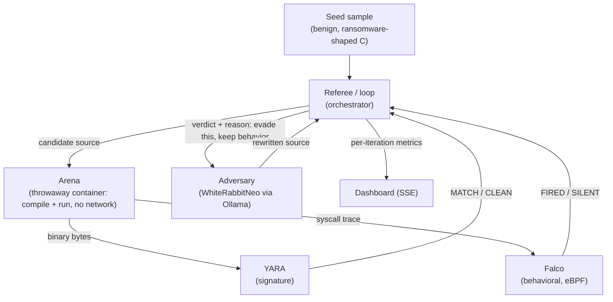

# Hydra — Architecture

Status: Draft
Last updated: 2026-08-18

Hydra is an adversarial evasion lab. A local, security-tuned LLM tries to rewrite
a benign malware sample to slip past two real detectors, in a closed loop, and we
measure how each detector holds up. The result is a number, not a scripted reveal:
the signature detector is evaded in a few iterations; the behavioral detector is
not evaded at all while the sample still behaves like malware.

This document is the engineering source of truth. It assumes an empty repository
and describes the system to be built.

Tagline: kill one signature, it grows a new head.

## 1. Context and problem

Signature detection identifies a file by its bytes. Metamorphic malware defeats
this by rewriting itself between runs: same behavior, new bytes, new hash. This is
an old technique, but in 2025 Google's threat intelligence group reported field
malware that uses an LLM to do the rewriting (PromptFlux, PromptLock). The new
element is not "the bytes change" — template engines have done that for decades —
it is that the rewriter can **reason about why it was detected and adapt**.

That raises the question this project answers: when the adversary is an LLM that
adapts to a detector's feedback, which kind of detection survives? Signature, or
behavior?

## 2. What Hydra is, and what it proves

Hydra runs a closed loop:

1. A benign, ransomware-shaped sample is compiled and run in a throwaway sandbox.
2. Two real detectors judge it: YARA (signature) and Falco (behavioral, eBPF).
3. Whichever detector caught it, its verdict and reason are fed to a local LLM
   (WhiteRabbitNeo via Ollama), which rewrites the sample to evade that detector
   while preserving behavior.
4. Recompile, re-run, re-judge. Repeat.

Measured outcomes:

- Signature (YARA): evaded after a small number of iterations. Changing bytes is
  easy, so the adversary wins quickly.
- Behavioral (Falco): not evaded across the run, as long as the sample still
  performs the ransomware behavior. The only way the adversary evades the
  behavioral rule is to stop doing the malicious action — which the loop detects
  and reports.

The claim this proves: against an adaptive AI adversary, signatures are brittle
and behavior is robust, because evading behavior requires abandoning the behavior.

Why the LLM is necessary: the loop closes on detector *feedback*. A template
mutator can permute bytes (enough to beat a signature) but cannot read "Falco
fired because you rewrote 50 files with high-entropy content" and reason about it.
The adaptation step is the LLM's job and cannot be done without a reasoner.

## 3. Scope, non-goals, and ethics

This is authorized, defensive detector-robustness research: a benign sample, our
own detectors, offline, to show why behavioral detection is stronger. It is not a
tool for evading third-party defenses.

Non-goals and hard limits:

- The sample is benign (section 6). It has no capacity to harm real data, reach
  the network, or persist.
- The evasion target is only Hydra's own lab detectors. Nothing here is aimed at
  production AV/EDR.
- Real malware is never executed. It is used only for static rule validation, in
  an isolated context (section 9.3), and that step is optional.
- Everything runs offline on one laptop. No sample or telemetry leaves it.

## 4. System overview



The referee is the only stateful control point. The arena is disposable and
network-isolated. The two detectors are real, off-the-shelf tools. The adversary
is a local model; nothing in the loop requires the network.

## 5. The adversarial loop

```mermaid
sequenceDiagram
  participant R as Referee
  participant A as Adversary
  participant N as Arena (container)
  participant Y as YARA
  participant F as Falco
  R->>N: run seed S0
  N->>Y: bytes
  N->>F: syscalls
  Y-->>R: MATCH (rule seeded on S0)
  F-->>R: FIRED (ransomware rule)
  loop until target detector evaded, or iteration cap
    R->>A: source + "caught by <detector>: <reason>; evade it, preserve behavior"
    A-->>R: rewritten source S'
    R->>N: compile + run S' (no network, resource-limited)
    N-->>R: compiled?, syscall trace, entropy, files-written
    R->>R: behavior-preservation gate (section 5.1)
    R->>Y: scan S'
    R->>F: evaluate S'
    Y-->>R: MATCH / CLEAN
    F-->>R: FIRED / SILENT
    R-->>R: record iteration metrics
  end
```

The run has two tracks, executed in sequence:

- Track 1 — evade the signature. Target YARA. Expected to succeed in a few
  iterations. Records `iterations_to_evade_signature`.
- Track 2 — evade the behavior. Target Falco, with the behavior-preservation gate
  enforced. Expected to fail: every behavior-preserving rewrite still trips Falco.
  Records `behavioral_evasions_while_behavior_preserved` (target: 0). A final,
  ungated step lets the adversary break behavior to evade Falco, demonstrating
  the tradeoff.

### 5.1 Behavior-preservation gate

After each run the referee decides whether S' still exhibits the ransomware
behavior class, from the arena observations (not from the source): at least K
distinct files created and rewritten in place, with per-file written-content
Shannon entropy at or above H, within one execution. A candidate that no longer
passes the gate has abandoned the behavior; in Track 2 that is recorded as
"evaded only by ceasing to be malware." K and H are fixed constants recorded next
to the Falco rule and chosen so the gate does not trip on trivial processes.

### 5.2 Adversary feedback

The prompt to the adversary includes the current source and a structured reason:

- YARA caught it: the matched rule name and the specific strings/byte pattern that
  matched. Instruction: remove those byte features, preserve behavior.
- Falco caught it: the fired rule and the syscall pattern (e.g. "opened and
  rewrote N files with high-entropy content"). Instruction: evade, preserve
  behavior.

If a candidate does not compile, the referee returns the compiler error to the
adversary and retries, up to a per-iteration retry cap. If the adversary is
unavailable, a deterministic byte/identifier mutator stands in for Track 1 only
(it cannot adapt, so it is not used for Track 2).

## 6. The sample and its safety

The seed sample is benign and ransomware-shaped. On each run, inside the arena, it:

1. creates a private working directory in the container's ephemeral filesystem;
2. writes K throwaway files with known plaintext there;
3. rewrites each file in place with high-entropy content, using a key it retains
   (reversible);
4. decrypts to confirm reversibility, then exits.

It presents the behavior behavioral detectors target — many files rewritten with
high-entropy content in a short window — which is what makes the Falco result
meaningful. It touches only files it created this run.

Safety invariants (enforced and checked, section 10):

1. The container runs with no network (`--network=none`), no host mounts, dropped
   capabilities, a seccomp profile, CPU/memory/time limits, and is removed after
   the run.
2. The sample writes only inside its working directory in the container.
3. The rewrite is reversible; nothing is destroyed.
4. No network and no persistence syscalls occur; their absence is verified from
   the trace. A candidate that introduces a network syscall is rejected.
5. The adversary rewrites only this sample; the prompt forbids adding capability,
   and the referee rejects candidates that violate invariant 4.

## 7. Components

| Component | Path | Responsibility |
|---|---|---|
| Seed sample | `sample/seed.c` | The benign, ransomware-shaped starting source. |
| Adversary | `adversary/llm.py` | Build the evade prompt from detector feedback; call WhiteRabbitNeo via Ollama; return rewritten source. |
| Offline mutator | `adversary/mutator.py` | Deterministic byte/identifier permutation; Track-1 fallback only. |
| Arena | `arena/run.py`, `arena/Dockerfile` | Compile and run a candidate in a throwaway, network-isolated container; capture syscalls, entropy, files. |
| Signature detector | `detectors/yara_detector.py`, `detectors/rules/` | Seed a YARA rule from S0; scan each binary. |
| Behavioral detector | `detectors/falco_detector.py`, `detectors/hydra_ransomware.yaml` | Evaluate the Falco ransomware rule against the trace. |
| Referee | `referee/loop.py` | Drive the loop, the two tracks, the gate; record metrics to `results.json`. |
| Server | `server.py` | HTTP + SSE control point for the live dashboard. |
| Dashboard | `ui/index.html` | SSE client: renders each iteration, the rewrite diff, and the final metrics. |
| Validation | `validate/` | Static checks that the detection rules fire on real ransomware (section 9.3). |

## 8. Runtime and sandbox

The arena runs Linux. On the macOS demo laptop, Colima provides the Linux VM and
Docker runtime; candidates run as throwaway containers inside it.

- Compilation and execution happen in the container, never on the host.
- The container has no network and no host filesystem access.
- Falco runs against the container to capture and evaluate behavior (eBPF).

Decision on behavioral capture: Falco is the primary behavioral detector. If Falco
cannot load its eBPF probe in the Colima kernel, the fallback is `strace`-based
syscall capture inside the container evaluated against the same rule logic; the
Falco rule remains the specification. The fallback is a capture mechanism swap
only — the behavioral claim is unchanged.

## 9. Detectors

### 9.1 Signature — YARA

At baseline the referee generates a YARA rule from S0 (its hash plus a byte
pattern taken from a region specific to this build — for example its embedded
string constants — that is, exactly the kind of feature a later rewrite alters)
and writes it to `detectors/rules/`. `scan` runs the `yara` binary against a
candidate and returns MATCH or CLEAN. Signing a build-specific region is what
makes the signature evadable: once the adversary rewrites that region the rule no
longer matches. This is the standard signature workflow, using the standard tool.

### 9.2 Behavioral — Falco

The behavioral detector is a Falco rule for ransomware-shaped activity (bulk
rewrite of files with high-entropy content), adapted from Falco's published
ransomware detection. Falco evaluates the syscall stream from the arena and
reports FIRED or SILENT. Because the rule keys on behavior, byte-level rewrites do
not change its verdict.

### 9.3 Real-malware validation (optional, gated)

To show the rules are real and not tuned only to our sample:

- The behavioral rule is Falco's ransomware rule (or a close adaptation), which the
  Falco project validates against real ransomware. We show it fires on our safe
  sample and cite its real-world detections.
- Optionally, the YARA rules used for context are published community rules; they
  can be run statically against a real ransomware sample set in an isolated VM.
  Samples are never executed and never touch the host. This step is optional and
  omitted if sample handling is not approved.

## 10. Metrics, success criteria, and validation

Per iteration, recorded to `results.json`:
`{ iteration, track, target_detector, source_sha256, compiled, behavior_preserved,
files_written, entropy, yara: MATCH|CLEAN, falco: FIRED|SILENT, provenance:
llm|offline }`.

Summary:
`{ iterations_to_evade_signature, signature_evaded, total_iterations,
behavioral_evasions_while_behavior_preserved, behavioral_evasion_required_breaking_behavior }`.

Success criteria (the run is a valid proof when):

- signature is evaded within the iteration cap (`signature_evaded == true`);
- `behavioral_evasions_while_behavior_preserved == 0`;
- the final ungated step evades Falco only with `behavior_preserved == false`.

Validation, all gating before a demo:

- Unit: the gate fires on the sample and not on a control process; the YARA seed
  rule matches S0 and no evolved variant; the Falco rule fires on the sample.
- Integration: a full loop produces the summary above.
- Safety: from the trace, the sample opens no path outside its working directory
  and makes no network syscall; the container is removed after each run.
- End-to-end: the SSE contract (section 11) drives the dashboard for a live run
  and a replayed run identically.

## 11. SSE event contract

`GET /run` streams `text/event-stream`. Named events with JSON `data`. Consumers
ignore unknown fields.

| Event | Payload | Meaning |
|---|---|---|
| `baseline` | `{ "sha256": str, "yara": "MATCH", "falco": "FIRED" }` | Both detectors catch the seed. |
| `rewrite_token` | `{ "text": str }` | A chunk of the adversary's streamed rewrite. |
| `rewrite_done` | `{ "iteration": int, "track": int, "target": "yara\|falco", "provenance": "llm\|offline" }` | Candidate produced. |
| `arena` | `{ "compiled": bool, "files_written": int, "entropy": number, "behavior_preserved": bool, "error": str? }` | Arena observations. |
| `verdict` | `{ "iteration": int, "yara": "MATCH\|CLEAN", "falco": "FIRED\|SILENT", "sha256": str }` | Detector results for the candidate. |
| `summary` | the summary object in section 10 | End of a track or the run. |
| `error` | `{ "stage": str, "message": str }` | Recoverable error; the run may continue. |

`GET /replay` emits the same sequence from a recorded run, so the dashboard code
path is identical live or replayed.

## 12. Repository layout

```
common/contracts.py              shared data contracts (imported by every lane)
common/config.py                 thresholds (K, H), iteration cap, model config
common/logging.py                logger factory
common/entropy.py                Shannon entropy helper
sample/seed.c                    benign, ransomware-shaped seed source
arena/run.py                     throwaway-container compile + run + capture (fake mode for now)
arena/Dockerfile                 arena image (gcc + strace)
arena/entrypoint.sh              in-container compile + strace + emit observation
detectors/yara_detector.py       signature detector (YARA; python fallback until wired)
detectors/falco_detector.py      behavioral detector (evaluates the class rule)
detectors/hydra_ransomware.yaml  behavioral rule (spec)
detectors/rules/                 generated YARA rules land here at runtime
adversary/llm.py                 WhiteRabbitNeo (Ollama) adversary + feedback prompt
adversary/mutator.py             deterministic mutator (Track-1 fallback)
referee/loop.py                  the adversarial loop, tracks, metrics
referee/gate.py                  behavior-preservation gate
server.py                        HTTP + SSE server
ui/index.html                    SSE dashboard
tests/                           unit tests (stdlib unittest)
validate/                        static real-malware rule validation (gated)
Makefile                         run / test / dashboard / setup / arena-build
results.json                     measured output (generated)
.env.example                     environment template (no secrets)
```

## 13. Build order

1. Arena: throwaway container that compiles and runs a source with no network and
   resource limits, and returns a syscall trace. Land the safety checks here first.
2. Seed sample + behavior-preservation gate + the safety test. Nothing mutated
   runs until the safety test passes.
3. YARA detector: seed a rule from S0, scan candidates.
4. Falco detector (with the strace fallback) and the behavior rule.
5. Referee loop: Track 1, then Track 2 with the gate; write `results.json`.
6. Adversary: WhiteRabbitNeo via Ollama with the feedback prompt; offline mutator
   as the Track-1 fallback.
7. Server + dashboard over the SSE contract; record a replay.
8. Optional: gated static real-malware validation.

## Appendix A. Environment

```
HYDRA_OLLAMA_HOST=http://127.0.0.1:11434     # local Ollama
HYDRA_ADVERSARY_MODEL=<whiterabbitneo tag>   # verify exact tag when pulling
HYDRA_RDSEC_BASE=                            # optional cloud backup (OpenAI-compatible)
HYDRA_RDSEC_KEY=                             # from an untracked .env; never committed
```

## Appendix B. Run

```
# one full adversarial run, headless
python3 referee/loop.py --iterations 12

# live dashboard
python3 server.py            # then open the served URL
```
